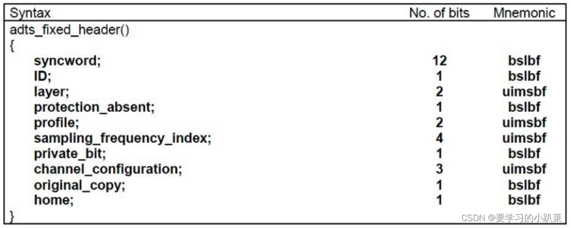

## 0. 主要任务

1. 实现本地mp4/flv视频的信息读取，信息包括(视频持续长度，编码方式(例如是hevc还是h264等)，分辨率、码率、声道数、音频采样率)
2. 实现本地mp4/flv视频解复用，视频流保存到本地为264,265文件，音频流保存到本地为aac文件，并且可以通过ffmpeg命令行进行准确播放
3. 实现本地mp4/flv视频解复用，解码
   1. 保存YUV数据到本地，用ffmpeg命令行播放
   2. 调用SDL2进行视频的显示，并根据视频的帧间隔进行同步
4. 实现本地mp4/flv视频解复用，解码
   1.  保存PCM数据到本地，用ffmpeg命令行播放
   2. 调用SDL2进行音频的播放
5. 实现本地mp4/flv视频的解复用，同时利用SDL2进行视频/音频的播放  

​	实际上就是上面的这些东西，下面记录一下各种东西。

## 1. 获取视频信息

​	这部分应该是最简单的。通过avformat_open_input函数和avformat_find_stream_info函数打开指向这个视频上下文的指针，就可以通过指针得到一系列信息。

​	需要注意的是，这个上下文指针pctx指向的是整个视频的信息，那么**一个视频中是有多个流的，比如音频流、视频流、字幕流**等等，这时候要遍历pctx指向的所有流，找出视频流和音频流，分别提取出信息。信息存放在流指针pctx->streams[i]指向的地址中，或者放在pctx->streams[i]->codecpar即解码器参数指向的地址中。直接读取并打印即可。

## 2. 解复用视频和音频

​	这个任务是要将视频文件的视频流和音频流都提取出来，放到本地生成h264文件和aac文件，并保证能够ffpeg命令行播放。那么这就要区分视频和音频两种情况了。

### 2.1 视频解复用为h264文件

​	一般来说，音视频文件中的视频流都是h264格式的，但将其解复用出来保存到本地没法直接播放，这是因为h264也有不同的编码格式。主要有annexb和avcc两种格式。还有就是，**经过h264编码后的单元叫做NALU，并且分两类，一类是VCL，保存的是视频内容，一类是非VCL，保存的是视频编码的参数信息**。两种编码格式的组织是这样的：

+ 对annexb格式来说，每个NALU前面都有一个起始码，并且**非VCL文件也保存在NALU流中**，所以含有视频的编码信息，可以进行播放。
+ 对于avcc格式来说，每个NALU前面都是一个length字段表示长度，并且**NALU流中不会保存额外信息，编码信息保存在外部的extradata字段中**。

​	音视频文件比如mp4中使用的一般是avcc格式，因为比较好保存。所以**如果直接提取其中的视频流，提取出来的仅有VCL而没有非VCL的编码部分**，所以**一般要从extradata中将视频的编码信息读取出来，再将avcc格式转换为annexb格式**。

​	luckily，ffmpeg提供了过滤器，可以完成这一点，所以直接使用过滤器就可以了。

### 2.2 音频解析为aac文件

​	aac文件也有很多编码方式，不过这里一概使用ADTS方式了。这种方式的特点是，**每一帧的最开始都有一个ADTS头，这个头中描述了aac流的各种信息**。但**mp4文件中的aac流是raw aac，所以是没有这个头的，需要手动添加这个头。**至于为什么是raw，gpt说mp4有另外的地方存储这些头部信息，所以就不会重复地存储这部分了。

​	所以解复用的时候需要将ADTS头部加上，unluckily，ffmpeg这次没有过滤器来做这个。所以只能手动加入了。这部分我是在网上找的代码来加入的，头部实际上有下面几种，一般是7或者9字节的。**另外，mp4文件中adts头部所需的信息也在extradata中保存**。



​	然后手动加上这个头部之后，就不需要经过过滤器处理aac了，直接将每一帧的raw aac流输出到本地文件即可。

## 3. 解码音频和视频

​	上面是将编码好的视频和音频放在本地，使用播放器进行播放，那么下面这个就是将编码的文件解码，再进行播放了。解码主要是用的是解码器decoder。还是分视频和音频来记录吧。

### 3.1 视频解码为yuv文件

​	既然牵扯到解码，那么解码器就必须要使用了，解码器主要是将封装好的h264文件解码为yuv格式，**对于ffmpeg库来说，默认的解码器就是将h264解码为yuv格式的，所以这部分也不需要进行设置和改动**，具体来说是转换为yuv420p的格式。这个部分主要麻烦的是各种东西的初始化和函数的调用，真说到原理上也没什么东西的。

​	然后为了保证最后输出的文件格式是yuv420p的，还需要使用sws_scale这个函数来进行一步转换，这部分也没有什么，设置好参数就可以了，其实可以直接看源码的。就没有什么好赘述的了，剩的都是debug。

​	使用ffmpeg进行播放的时候，注意要使用下面的语句：

```ffmpeg
ffplay -video_size 1080x1920 -pixel_format yuv420p video.yuv
```

​	其中分辨率是按照视频来的，这部分没有什么好办法，然后format是转换之后的。

### 3.2 音频解码为pcm文件

​	音频的解码也是需要一手解码器的，解码器可以直接将aac流解码为pcm流，但还是同样的问题，解码器输出的pcm流的采样率、声道数之类的是源aac流相同的，那么这些参数就是不固定的。所以还需要一步重采样来将输出定为一样的。这个地方是这样定的：

```c++
AVChannelLayout out_channel_layout;
av_channel_layout_from_mask(&out_channel_layout, AV_CH_LAYOUT_STEREO);
int out_nb_sample = 1024;   // 采样个数
enum AVSampleFormat out_sampleFormat = AV_SAMPLE_FMT_S16;
int out_sample_rate = 44100;
int out_nb_channels = out_channel_layout.nb_channels;
```

​	之后将解码后的frame中的data放入swr_convert函数中进行重采样，就可以得到重采样之后的规范化结果。播放的时候要使用下面的语句：

```ffmpeg
ffplay -f s16le -ar 44100 -ac 2 audio.pcm
```

​	代表的是播放16位小端有符号整数存储，采样率为44.1kHZ，通道数为2的pcm流。

## 4. 使用SDL2库播放解码文件

​	这部分就是使用SDL2库来对解码后的yuv和pcm文件进行播放。还是分两个部分，一个是yuv文件播放一个是pcm文件播放。对SDL2库来说，我是又开了一个项目来写的，相当于一个解码器项目和一个播放器项目。

### 4.1 SDL2库播放yuv文件

​	想要使用SDL2库播放yuv文件或者是任何视频，基本上都要下面这三个东西：

+ 窗口：这个是打开一个窗口，后面要在这个窗口中进行播放操作
+ 渲染器：渲染器是绑定窗口的，为了在窗口上渲染出画面
+ 纹理：将数据映射到纹理上，再将纹理放入渲染器中，便可以完成图像在窗口山的显示

​	所以过程很简单，在创建和初始化好上面三个对象之后（注意要设置纹理的类型为yuv420p），从文件中读取一帧yuv数据，用数据更新纹理，再映射到渲染器上，让渲染器更新到窗口上，这时候就可以完成这一点了。

​	还有很重要的一点就是事件。**SDL中，事件管理着窗口的开关，如果没有设置事件，窗口可能会认为你这是一个卡住的窗口，就不予显示了**，这个bug卡了我很久。设置好事件之后，监听事件来确定是不是要关闭窗口，进而执行相应操作即可。

### 4.2 SDL2库播放pcm文件

​	这部分基本上是通过SDL库提供的SDL_AudioSpec这个类产生的对象来完成的。**当创建这个类的对象时，会创建一个播放缓冲区，并创建一个线程来管理播放操作**。这时候我们需要做的就是**给这个对象写一个播放缓冲区空时的回调函数，这个函数将播放数据放到播放缓冲区，而后该对象会自动播放**。

​	所以这部分代码比较简单，甚至都没有什么弯弯绕绕，读取文件数据，放到自己的缓冲区中，等待回调函数调用，一旦调用回调函数就将自己缓冲区中的数据放到播放缓冲区中，这时候就解决问题了。

## 5. 音视频同步播放器

​	这才是这个demo的大头，比之前的所有任务都上了一个台阶，所以要做好还是比较麻烦的。下面记一下初版的想法：

+ 音视频同步来说，主要的就是开线程了，多个线程来处理不同的操作。目前来说估计是四个线程一起合作的：
  + 主线程对所有东西进行初始化，然后监听视频帧队列，一旦有视频帧到达，就从这个队列中取出，用SDL进行视频的播放，播放放到主线程这里是因为方便SDL窗口的控制，如果放到子线程可能不好控制了
  + 开一个解复用线程，这个线程主要将音视频解复用为视频和音频，分别放到两者的队列中，然后要开下面的两个线程
  + 开一个视频解码线程，这个线程读取队列中的frame，将其解开成为yuv帧，放入yuv队列中
  + 开一个音频解码播放线程，注意这个线程是SDL库自动管理的，所以只要定义好callback函数之类就可以让其自己运行

​	现在基本是写完了，就是照着上面那个架构来写的。有几个点需要记一下：

+ 首先上面几个线程不是很难，都可以随便写出来。

+ 主要就是同步的那一步，怎么获得视频播放时候音频播放到哪里了。

  ```c++
  double get_audio_clock(PlayerState* is) {
      double pts=is->audio_clock;//Maintained in the audio thread，取得解码操作完成时的当前播放时间戳
      //还未(送入声卡)播放的剩余原始音频数据长度，等于解码后的多帧原始音频数据长度-累计送入声卡的长度
      int hw_buf_size=is->audio_buffer_size-is->audio_index;//计算当前音频解码数据缓存索引位置
      int bytes_per_sec=0;//每秒的原始音频字节数
      int pcm_bytes=is->pAuCodecCtx->ch_layout.nb_channels * 2;//每组原始音频数据字节数=声道数*每声道数据字节数
      bytes_per_sec=is->pAuCodecCtx->sample_rate * pcm_bytes;//计算每秒的原始音频字节数
      if (bytes_per_sec) {//检查每秒的原始音频字节数是否有效
          pts-=(double)hw_buf_size/bytes_per_sec;//根据送入声卡缓存的索引位置，往前倒推计算当前时刻的音频播放时间戳pts
    }
    return pts;//返回当前正在播放的音频时间戳
  }
  ```

  ​	首先在音频SDL线程调用回调函数填充声卡时，要记录下现在解码并放入声卡到哪里了，然后再计算当前播放了多少，将未播放的剪掉得到最后结果。

  具体可以看这个url记录的博客：https://blog.csdn.net/yinshipin007/article/details/130534781


